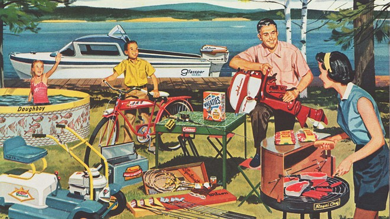

class: center, middle
```{r, echo=F, message=F, warning=F,  out.width = '300px'}
library("tidyverse")
library("ineq")

theme_set(theme_bw())
options(digits=3, scipen = 100)
```




---
## Confusiones comunes sobre movilidad social en discurso público

<br>
<br>
--

- Movilidad social = movilidad social ascendente, American Dream, Land of Opportunity, 'rags-to-riches'  

<br>
--

- Movilidad social para todos

<br>
--

<br>
--
- (más sutil) Movilidad social = igualdad de oportunidades, meritocracia. 

  - Movilidad como alternativa a desigualdad 

---
class: inverse, center, middle

## Movilidad social/económica intergeneracional 


---
## Dos tipos de movilidad 

<br>
<br>
--

  - .bold[Movilidad absoluta:] comparación con respecto a posición de los padres (ascendente,inmovil, descendente): quién se mueve, cuánto y hacia donde. 
  
<br>
--

- .bold[Movilidad relativa:] comparación con respecto a posición relativa de los padres: ¿Cuán importante son los "accidentes de la cuna" para determinar el destino de una persona?


---
### Sociedad A

.pull-left[

<br>
<br>
<br>

|   **Padres**  |   **Hijos**   |
|:-------------:|:-------------:|
|  5 (rank = 2) | 10 (rank = 2) |
| 10 (rank = 1) | 20 (rank = 1) |
]

--

.pull-right[

- Misma desigualdad económica en ambas generaciones (2:1).

- Todos los individuos tienen una mejor situación social/económica que sus padres. En esta sociedad todos experimentan .bold[movilidad absoluta] ascendente.

- Todos los individuos tienen el mismo "ranking" social/económico de sus padres. En esta sociedad no hay .bold[movilidad relativa].


]

---
### Sociedad B

.pull-left[

<br>
<br>
<br>

|   **Padres**  |   **Hijos**   |
|:-------------:|:-------------:|
|  5 (rank = 2) | 10 (rank = 2) |
| 10 (rank = 1) | 5  (rank = 1) |
]

--

.pull-right[

- Misma desigualdad económica en ambas generaciones (2:1).

- Algunos individuos tienen una mejor situación social/económica que sus padres y otras una peor situación. En esta sociedad algunos experimentan .bold[movilidad absoluta] ascendente y otros .bold[movilidad absoluta] descendente.

- Todos los individuos tienen un "ranking" social/económico  distinto al de sus padres. En esta sociedad hay .bold[movilidad relativa] perfecta.


]


---
## ¿Movilidad social con respecto a que?

<br>

- Clase social (clase ocupacional)

- Status (prestigio)

- Educación

- Ingresos 

- Riqueza

- Salud,

- Posición política, etc. 


---
class: inverse, center, middle

# Medidas de movilidad social relativa
## Elasticidad intergeneracional de ingresos

---
## Elasticidad intergeneracional de ingresos

<br>

$$\log y^{\text{child}} = \alpha + \beta \log y^{\text{par}} + \varepsilon$$
<br>
--

- $y^{\text{child}}$ ingreso permanente hijo

- $y^{\text{par}}$ ingreso permanente padres

- $\varepsilon$ lo que el dinero de los padres no explica

<br>
--

- $\beta = \frac{\%\Delta y^{\text{child}}}{\%\Delta y^{\text{par}}}$ (elasticidad)

--

- $(1 - \beta)$ es un índice de movilidad social.


---
## Elasticidad intergeneracional de ingresos


```{r, echo=FALSE}
library("tidyverse")
library("ggplot2")
library("ggsci")
library("cowplot")

jitter <- position_jitter(width = 0.03, height = 0)

n = 10000
x = rlnorm(n, meanlog = 0, sdlog = 1)
logx = log(x)
```

.bold[Inmovilidad relativa perfecta]: $\beta=1$

```{r, echo=FALSE, fig.height=4, fig.width=7, message=FALSE, warning=FALSE}
logy = 0 + 1*logx + rnorm(n,0,1/2)
data <- tibble(x=logx, y=logy, z=round(x,0), mob=if_else(y>x,1,0), zz=ifelse(z==-4,1,ifelse(z==4,2,0))) 

data %>% ggplot(aes(x=x,y=y, colour=mob)) + geom_point(alpha=0.07) + geom_smooth(method = "lm", se = FALSE) + ylim(-4,4) + xlim(-4,4) + labs(x="Ingreso permanente hijos (log)", y="Ingreso permanente hijos (log)", subtitle="Elasticidad intergeneracional de ingresos (IGE)",
colour=NULL) + theme(legend.position = "none")
```

---
## Elasticidad intergeneracional de ingresos

.bold[Movilidad relativa perfecta]: $\beta=0$

```{r, echo=FALSE, fig.height=4, fig.width=7, message=FALSE, warning=FALSE}
logy = 0 + 0*logx + rnorm(n,0,1/2)
data <- tibble(x=logx, y=logy, z=round(x,0), mob=if_else(y>x,1,0), zz=ifelse(z==-4,1,ifelse(z==4,2,0))) 

data %>% ggplot(aes(x=x,y=y, colour=mob)) + geom_point(alpha=0.07) + geom_smooth(method = "lm", se = FALSE) + ylim(-4,4) + xlim(-4,4) + labs(x="Ingreso permanente hijos (log)", y="Ingreso permanente hijos (log)", subtitle="Elasticidad intergeneracional de ingresos (IGE)",
colour=NULL) + theme(legend.position = "none")
```

---
## Elasticidad intergeneracional de ingresos

.bold[Baja tasa de movilidad relativa]: $\beta=0.5$

```{r, echo=FALSE, fig.height=4, fig.width=7, message=FALSE, warning=FALSE}
logy = 0 + 0.5*logx + rnorm(n,0,1/2)
data <- tibble(x=logx, y=logy, z=round(x,0), mob=if_else(y>x,1,0), zz=ifelse(z==-4,1,ifelse(z==4,2,0))) 

data %>% ggplot(aes(x=x,y=y, colour=mob)) + geom_point(alpha=0.07) + geom_smooth(method = "lm", se = FALSE) + ylim(-4,4) + xlim(-4,4) + labs(x="Ingreso permanente hijos (log)", y="Ingreso permanente hijos (log)", subtitle="Elasticidad intergeneracional de ingresos (IGE)",
colour=NULL) + theme(legend.position = "none")
```

---
## Movilidad relativa y movilidad absoluta

.pull-left[

$\beta$ = 0.5 + crecimiento

```{r, echo=FALSE, fig.height=4, fig.width=7, message=FALSE, warning=FALSE}
logy = 2 + 0.5*logx + rnorm(n,0,1/2)
data <- tibble(x=logx, y=logy, z=round(x,0), mob=if_else(y>x,1,0), zz=ifelse(z==-4,1,ifelse(z==4,2,0))) 

data %>% ggplot(aes(x=x,y=y, colour=mob)) + geom_point(alpha=0.07) + geom_smooth(method = "lm", se = FALSE) + ylim(-4,4) + xlim(-4,4) + labs(x="Ingreso permanente hijos (log)", y="Ingreso permanente hijos (log)", subtitle="Elasticidad intergeneracional de ingresos (IGE)",
colour=NULL) + theme(legend.position = "none")
```
]

.pull-right[

$\beta$ = 0.5 + decrecimiento

```{r, echo=FALSE, fig.height=4, fig.width=7, message=FALSE, warning=FALSE}
logy = -2 + 0.5*logx + rnorm(n,0,1/2)
data <- tibble(x=logx, y=logy, z=round(x,0), mob=if_else(y>x,1,0), zz=ifelse(z==-4,1,ifelse(z==4,2,0))) 

data %>% ggplot(aes(x=x,y=y, colour=mob)) + geom_point(alpha=0.07) + geom_smooth(method = "lm", se = FALSE) + ylim(-4,4) + xlim(-4,4) + labs(x="Ingreso permanente hijos (log)", y="Ingreso permanente hijos (log)", subtitle="Elasticidad intergeneracional de ingresos (IGE)",
colour=NULL) + theme(legend.position = "none")
```
]


---
##Correlaciones entre hermanos

<br>
.bold[Intuición]:

--
<br>

- Hermanos comparten genes y ambiente (por ejemplo, familia, escuela, barrio).

--

- Si ambiente y factores genéticos son importantes para la obtención de resultados socioeconómico, los hermanos obtendrían resultados similares entre sí.

--

- Mayor similitud en resultados indicaría mayor influencia atribuible a los antecedentes familiares y comunitarios.


---
## Correlaciones entre hermanos

$$y_{ij} = \underbrace{a_{j}}_{\text{componente familiar}} + \underbrace{\mu_{ij}}_{\text{componente idiosincrático}}$$
<br>
<br>
--

¿Que fracción de la variabilidad en ingresos occurre dentro de las familias (en vez de entre-familias)?

<br>

$$\rho = \frac{\sigma^{2}_{a}}{\sigma^{2}_{a}+\sigma^{2}_{\mu}}$$
<br>
--

- Correlación entre hermanos proporciona un límite superior para la influencia intergeneracional combinada de los factores genéticos y ambientales.

- Generalmente arroja un mejor poder predictivo que la IGE.

- *Limitaciones

---
## Otras medidas importantes


- Modelos log-lineales para tablas de contigencia cross-clasificando clase social del origen y denstino.

- Matrices de transiciones 


---
class: inverse, center, middle

##Hasta la próxima clase. Gracias!


<br>
Mauricio Bucca <br>
https://mebucca.github.io/ <br>
github.com/mebucca


